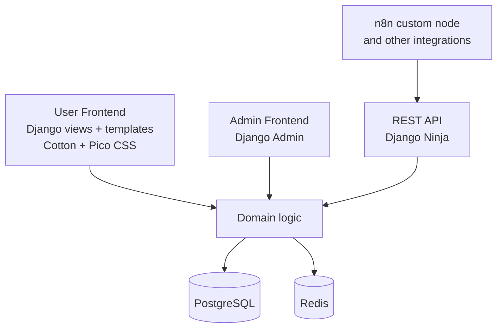

# Application Architecture

## Overview

The application is a Django-based system of record with three primary delivery
surfaces built on the same domain model and persistence layer.

These surfaces are intentionally separated by audience and responsibility:

- a user frontend for the product workflow
- an admin frontend for operational and data administration
- a REST API for integrations and automation

## Application Surfaces

### User frontend

The user frontend is the main product interface for demo presenters, users, and
group leads.

It is implemented with:

- Django views for request handling
- Django templates for server-side rendering
- Django Cotton for reusable UI components
- Pico CSS for the baseline visual layer
- HTMX for partial updates
- Server-Sent Events for live board updates where needed
- Django session-based authentication for all user frontend views

This surface is responsible for:

- Ticket workflow interaction
- Kanban Board rendering
- Ticket detail and update screens
- user-facing workflow navigation

Structurally, the user frontend should follow two related layout patterns.

The authentication view should use a split layout with a strong visual
hierarchy:

- a left panel for the functional login or sign-up flow
- a right panel for contextual product or industrial illustration
- interaction elements concentrated on the left side
- brand and context illustration concentrated on the right side

The authenticated application should transition into a top-down application
shell:

- a persistent top navigation bar for primary navigation
- a left-side burger menu that opens a collapsible detailed navigation panel
- a top-right utility area for Docs, API, Admin, Logout, and the authenticated
    user context
- a main content area for dashboards, issues, forms, tables, and reports

All user frontend views should require an authenticated Django session. If a
user is not authenticated, the application should redirect the request to the
login page.

### Admin frontend

The admin frontend is a separate operational surface built on Django Admin.

It is intended for:

- data administration
- internal maintenance tasks
- reference data management
- inspection of domain records during development and demos

This surface should not become the primary user workflow UI. It exists to
support administration of the application rather than day-to-day Ticket
processing.

The admin frontend also relies on Django's session-based authentication model.

The admin frontend should also support the shared application requirements for
light mode, dark mode, and multilingual behavior. Where custom admin-adjacent
pages are introduced, they should align with the same top-down navigation and
utility conventions used by the rest of the authenticated application shell.

### REST API

The REST API is the machine-facing integration surface built with Django Ninja.

It is intended for:

- external system integration
- automation flows
- API-driven Ticket creation and updates
- the n8n custom node

The API should expose the same core domain concepts as the web application while
keeping the web application as the system of record.

The REST API uses HTTP Basic Authentication instead of Django session login
redirects.

The current REST API surface includes:

- metadata endpoints for the authenticated user, groups, users, collections,
    and issue categories
- read projections for the board, dashboard, issue list, and issue detail
- mutation endpoints for issue creation, update, archive, comment creation,
    and board movement
- multipart attachment support on issue create, update, and comment flows so
    integrations can submit files through the same business rules used by the UI

## Shared Domain Layer

All three surfaces use the same underlying application data and business rules.

- The user frontend renders domain state for humans.
- The admin frontend manages and inspects domain data.
- The REST API exposes domain operations to systems.
- Users are represented through Django `User`.
- Groups are represented through Django `Group`.
- Branding starts from environment-backed Django settings and may be overridden
    by persisted `App Branding` configuration for the displayed product name,
    navbar logo, and login background image.

All operations and domain data models should be available through the REST API
in addition to the user and admin frontends.

This separation keeps presentation concerns independent while preventing
duplicate business logic across surfaces.

## Webapp Implementation Constraint

Within the Django web application, business logic should be structured through
controller classes per entity instead of being embedded directly into delivery
surfaces.

The required implementation patterns are:

- user frontend page flow: `view -> controller -> model`
- user frontend form flow: `view -> form -> controller -> model`
- model event flow: `signal -> controller`
- REST API flow: `REST API view -> controller -> model`

In this structure, Django models remain responsible for persistence and
data-level validation, while controller classes coordinate entity-specific
business rules.

## High-Level Structure

## Authentication Model

- The user frontend uses Django session-based authentication.
- Anonymous requests to user frontend views are redirected to the login page.
- The admin frontend uses Django Admin's session-based authentication flow.
- The REST API uses HTTP Basic Authentication.
- The REST API must provide access to the same domain operations and data models
    that the application exposes through its other surfaces.

## Routing Intent

The project should keep these URL spaces conceptually distinct:

- user frontend routes for human workflow pages
- `/admin/` for Django Admin
- `/api/` for Django Ninja endpoints

This makes ownership clear and keeps integration concerns separate from the
user-facing interface.

## Architectural Intent

The application uses one backend stack with multiple delivery surfaces rather
than separate applications. This keeps the system compact for demo scenarios
while still giving each audience an interface tailored to its purpose.

For the authenticated user experience, the structural intent can be summarized
as follows:

"The application uses a top-down layout with a persistent global navigation
bar. Primary navigation is exposed in the top bar, while a collapsible burger
menu on the left provides access to detailed and contextual navigation. Utility
links and the authenticated user context are placed on the top-right side. The
main content area is reserved for task-specific workflows and operational
views. Selected board workflows may temporarily omit this shell chrome for a
fullscreen presentation mode."