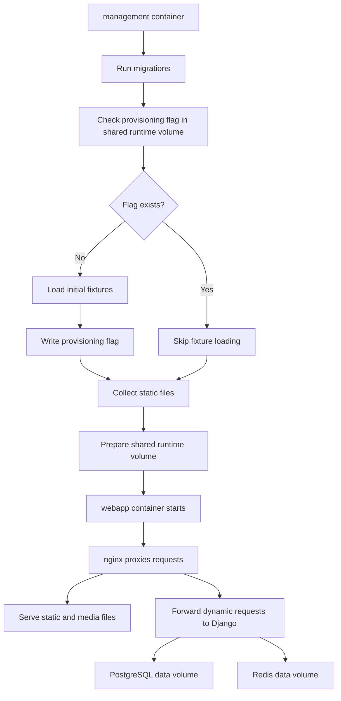

# Deployment Architecture

## Overview

The application is deployed as a containerized Django-based system with separate
runtime roles. Custom application containers are built from one Docker image and
switch behavior through role-specific start scripts.

## Runtime Roles

### Management container

Responsible for bootstrap work:

- run database migrations
- collect static files
- load initial fixtures on first boot only
- write static and media assets to the shared runtime volume
- write and check the provisioning flag in the shared runtime volume

### Web application container

Responsible for application traffic:

- run the Django application server
- serve the user frontend built with Django views, Cotton, and Pico CSS
- serve the admin frontend built with Django Admin
- expose the REST API built with Django Ninja
- connect to PostgreSQL, Redis, and shared volumes

### Nginx container

Responsible for edge traffic handling:

- act as reverse proxy
- serve static and media files from the shared runtime volume
- read HTTPS certificates from the shared runtime volume
- forward dynamic requests to the Django application

### PostgreSQL container

Stores persistent application data, including tickets, assignments, workflow
state, comments, and audit-related records.

PostgreSQL uses its own dedicated data volume so the database persists across
container restarts and rebuilds.

### Redis container

Provides cache and short-lived coordination capabilities for the application.

Redis uses its own dedicated data volume so persisted Redis data survives
container restarts when Redis persistence is enabled.

## Shared Volume Strategy

The proxy, management, and web application containers share one runtime volume.

This shared volume stores:

- static files
- media files
- HTTPS certificates
- provisioning markers such as the first-boot fixture flag

This keeps asset generation, runtime access, certificate handling, and
bootstrap coordination aligned across the deployment.

## Persistence Strategy

The deployment uses separate persistent volumes by responsibility:

- one shared runtime volume for proxy, management, and web application runtime
    assets and provisioning state
- one PostgreSQL data volume for the relational database
- one Redis data volume for Redis persistence

## Image Strategy

Custom application roles use the same image to reduce drift between bootstrap
and runtime environments.

```text
same image
-> management start script
-> webapp start script
```

## Startup Flow



## First-Boot Provisioning

Initial fixture loading should happen only during the first boot of the
deployment.

The management container is responsible for this process:

1. check for a provisioning flag in the shared runtime volume
2. if the flag is missing, load the initial fixtures
3. write the provisioning flag after successful fixture loading
4. skip fixture loading on later boots when the flag already exists

This approach keeps first-boot provisioning idempotent across container
restarts while avoiding repeated fixture imports.

## Architectural Intent

This deployment separates bootstrap concerns, application serving, proxying,
and infrastructure services. The split keeps responsibilities clear while still
allowing the project to ship and run as a compact demo environment. Within the
web application container, the application is further separated into a user
frontend, an admin frontend, and a REST API that share the same domain layer.
The deployment also separates shared runtime assets from PostgreSQL and Redis
data persistence so each storage concern has a clear lifecycle.