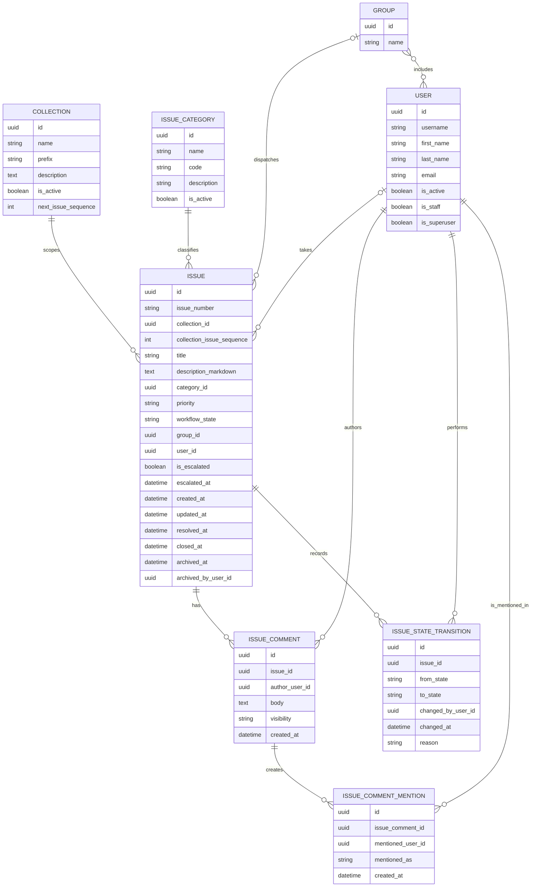

# Data Model

## Purpose

This document defines the conceptual data model for Ticket System Mock based on
the current product overview. It is intended for
contributors who need a shared understanding of the core entities, their
relationships, and the main modeling decisions before implementation details are
finalized.

## Scope

This is a contributor-facing domain model, not a final database schema. It
captures the entities and relationships that the application needs in order to
support:

- issue creation and processing
- markdown-backed issue descriptions
- group and individual dispatching
- user mentions inside issue comments
- personal dashboards for assigned work and mentions
- Kanban-based workflow visualization
- issue archival with soft-delete behavior
- API-driven integrations
- backend administration

## Modeling Decisions

### Use one authoritative lifecycle field

The product overview mentions both workflow phases and status. To avoid
duplicated state, the model should use one authoritative field for the issue's
position in the lifecycle. This document uses `workflow_state` for that purpose.

### Keep the Kanban board derived

The Kanban board is a projection of issues grouped by `workflow_state`. It does
not need its own persisted entity.

In the user frontend, this board is presented as the `Instance Kanban Board`.

### Keep the personal dashboard derived

The personal dashboard is a user-specific read model. It should be derived from
the user's direct issue assignments and from comment mentions that reference
that user rather than stored as its own persisted entity.

### Separate group membership from issue ownership

Group structure and issue ownership answer different questions. Membership
shows which users belong to which groups. Ownership shows which group
currently receives an issue for dispatch and which user from that group has
taken it.

### Map people and groups to Django auth

Users should use Django's built-in `User` model so authentication,
authorization, and permissions align with the Django permission system. Groups
should use Django's built-in `Group` model.

Because Django already provides the `User` to `Group` many-to-many
relationship, the conceptual `GroupMembership` does not need its own separate
application entity.

### Keep product display configuration in environment settings

The product display name should not be stored in application data. It should be
provided through environment-backed Django settings.

### Model escalation as a flag

Escalation should not be part of the workflow state enumeration. It should be a
separate flag on the Issue so an Issue can remain in its current workflow state
while also being marked as escalated.

### Keep category as admin-managed reference data

Issue categories should be managed through admin data instead of a hard-coded
enumeration.

### Scope issue identifiers through collections

Issue identifiers should not be derived from the database primary key. Each
Issue should belong to one Collection, and the Collection should own the
identifier prefix and the next local sequence number.

This document uses the format `TASK-000` to describe that rule. The numeric
portion must always render with at least three digits, while still allowing
larger values such as `TASK-1024`.

### Separate internal and customer-visible comments

Issue comments should distinguish between internal notes and customer-visible
comments.

### Store issue descriptions as markdown

An issue title should stay short plain text, while the issue description should
support large markdown content.

### Persist comment mentions as extracted relations

Comments may include `@username` mentions. The application should persist those
mentions as explicit relations so the personal dashboard can query them without
re-parsing every comment body.

### Archive issues through soft deletion

Issues should not be hard-deleted from application data. Archival in the user
frontend should use soft-delete behavior so issues remain auditable and can be
excluded from active views without losing history.

## Core Entities

### Issue

Represents a single support item moving through the fixed workflow.

Suggested fields:

- `id`
- `issue_number`
- `collection_id`
- `collection_issue_sequence`
- `title`
- `description_markdown`
- `category_id`
- `priority`
- `workflow_state`
- `group_id`
- `user_id`
- `is_escalated`
- `escalated_at`
- `created_at`
- `updated_at`
- `resolved_at`
- `closed_at`
- `archived_at`
- `archived_by_user_id`

### Group

Represents a Django group that can receive issue dispatches.

In Django terms, this should map to the built-in `Group` model.

Suggested fields:

- `id`
- `name`

If the project later needs group-specific metadata beyond Django `Group`, that
should be added through a separate profile-style model rather than replacing the
built-in permission grouping.

### Collection

Represents a logical grouping of issues that share a common identifier prefix.

Suggested fields:

- `id`
- `name`
- `prefix`
- `description`
- `is_active`
- `next_issue_sequence`

### User

Represents a Django user who can own issues, write comments, and perform
workflow changes.

In Django terms, this should map to the built-in `User` model.

Suggested fields:

- `id`
- `username`
- `first_name`
- `last_name`
- `email`
- `is_active`
- `is_staff`
- `is_superuser`

Relevant Django-backed fields and relationships:

- `username`
- `first_name`
- `last_name`
- `email`
- `is_active`
- `is_staff`
- `is_superuser`
- `groups`

### IssueCategory

Represents admin-managed reference data for issue classification.

Suggested fields:

- `id`
- `name`
- `code`
- `description`
- `is_active`

### IssueComment

Represents a comment or work note added during issue processing.

Suggested fields:

- `id`
- `issue_id`
- `author_user_id`
- `body`
- `visibility`
- `created_at`

Comment bodies may include `@username` mentions that resolve to explicit
mention records.

### IssueCommentMention

Represents a resolved user mention extracted from an issue comment.

Suggested fields:

- `id`
- `issue_comment_id`
- `mentioned_user_id`
- `mentioned_as`
- `created_at`

### IssueStateTransition

Represents an auditable lifecycle change for an issue.

Suggested fields:

- `id`
- `issue_id`
- `from_state`
- `to_state`
- `changed_by_user_id`
- `changed_at`
- `reason`

## Enumerations

### WorkflowState

Primary lifecycle states:

- `NEW`
- `TRIAGE`
- `ASSIGNED`
- `IN_PROGRESS`
- `WAITING`
- `RESOLVED`
- `CLOSED`

Exceptional states:

- `REJECTED`
- `DUPLICATE`

### IssuePriority

The product overview requires priority tracking but does not define values. A
starter set could be:

- `LOW`
- `MEDIUM`
- `HIGH`
- `CRITICAL`

### IssueCategory

Issue categories should be managed as admin-maintained reference data rather
than a hard-coded enumeration.

### IssueCommentVisibility

Issue comments should be separated by visibility:

- `INTERNAL`
- `CUSTOMER_VISIBLE`

## Relationships

- An `Issue` belongs to one `IssueCategory`.
- An `Issue` belongs to one `Collection`.
- An `Issue` can be associated to zero or one `Group` for dispatching.
- An `Issue` can be associated to zero or one `User`.
- If an `Issue` is associated to a `User`, that `User` should belong to the
  associated `Group`.
- An `Issue` has zero or more `IssueComment` records.
- An `IssueComment` has zero or more `IssueCommentMention` records.
- An `Issue` has zero or more `IssueStateTransition` records.
- A `User` can belong to zero or more `Group` records through Django's built-in
  `User.groups` relationship.
- A personal dashboard for one `User` is derived from directly assigned
  `Issue` records and `IssueCommentMention` records that point to that `User`.
- Archived issues remain stored and auditable through soft-delete fields rather
  than being hard-deleted.

## Entity Relationship Diagram

## Resolved Decisions

- `IssueCategory` is managed through admin-maintained reference data.
- Issue identifiers are scoped by `Collection` and formatted as `PREFIX-000`.
- Escalation is an Issue flag, not a workflow state.
- Issue comments are separated into customer-visible and internal comments.
- Issue archival uses soft-delete fields instead of hard deletion.
- Issue descriptions use a short title plus a large markdown body.
- `@username` references in comments are persisted as explicit mention records.
- A User is implemented as a Django `User` for authentication, permissions, and
  group membership.
- A Group is implemented as a Django `Group`.
- An Issue can be dispatched to at most one Group and taken by at most one User
  from that Group.
- The personal dashboard is a derived view over direct assignments and comment
  mentions, not a persisted entity.
- `product_display_name` belongs in environment-backed Django settings, not in a
  persisted configuration model.

## Implementation Notes

- Start with this conceptual model before introducing Django models.
- Keep `workflow_state` as the single lifecycle source of truth unless the
  product requirements later distinguish it from status.
- Keep issue numbering scoped by `Collection` so each prefix can maintain its
  own local sequence independently.
- Treat the Kanban board as a read model derived from issues rather than a
  stored structure.
- Treat the `Instance Kanban Board` as the user-facing projection of the
  derived Kanban board read model.
- Treat the personal dashboard as a read model derived from assigned issues and
  persisted comment mentions.
- Use Django `User` and `Group` as the foundation for user and group
  ownership.
- Model current dispatch directly on the Issue with optional Group and User
  associations instead of a separate assignment entity.
- Store issue descriptions as markdown-capable text and keep issue titles short
  and plain.
- Archive issues through soft-delete metadata instead of hard deletion.
- Keep `product_display_name` in environment settings rather than a database
  table.