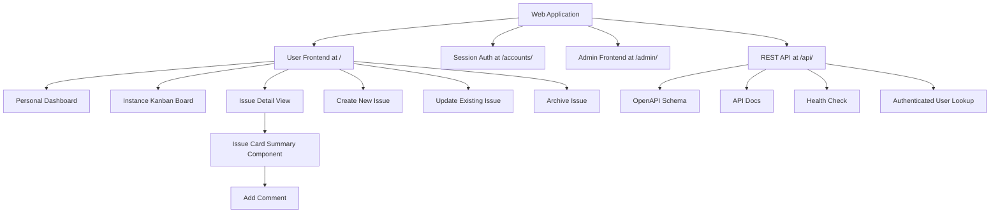

# Webapp Sitemap

## Purpose

This sitemap gives contributors a current view of the Django web application
route structure. It summarizes the user frontend, authentication endpoints,
admin surface, and REST API so route ownership stays easy to understand during
development.

## Table of Contents

- [Route Ownership](#route-ownership)
- [Top-Level Sitemap](#top-level-sitemap)
- [Resolved Route Tree](#resolved-route-tree)
- [Notes for Contributors](#notes-for-contributors)

## Route Ownership

- `/` is owned by `djangoapp.user_interface` and serves the authenticated user
  frontend. Within that frontend, the main user touchpoints should be the
  `Personal Dashboard`, the `Instance Kanban Board`, and the `Issue Detail View`.
- `/accounts/` is provided by Django's built-in authentication URL set and
  supports session-based login flows.
- `/admin/` is provided by Django Admin and serves the authenticated admin
  frontend.
- `/api/` is owned by `djangoapp.rest_api` and exposes the machine-facing REST
  API protected by HTTP Basic Authentication.

## Top-Level Sitemap



## User Frontend Pages and Components

- `Personal Dashboard`: shows the user's direct issue assignments and issue
  comments where the user was mentioned.
- `Instance Kanban Board`: shows the overall operational board grouped by
  workflow state.
- `Issue Detail View`: shows the full issue title, markdown description,
  comments, and workflow context.
- `Create New Issue`: starts a new issue in the user frontend.
- `Update Existing Issue`: edits an existing issue when reached from the
  `Personal Dashboard` or the `Instance Kanban Board`.
- `Archive Issue`: archives an issue using soft-delete behavior rather than a
  hard delete.
- `Issue Card Summary Component`: provides the reusable summary card used for an
  issue in list and board contexts.
- `Add Comment`: must be available anywhere the `Issue Card Summary Component`
  is visible.

## REST API Operations

- `OpenAPI Schema`: available at `/api/openapi.json` for machine-readable API
  discovery.
- `API Docs`: available at `/api/docs` as the interactive Django Ninja
  documentation UI.
- `Health Check`: available at `/api/health` and returns the basic API health
  status.
- `Authenticated User Lookup`: available at `/api/auth/me` and returns the
  authenticated user's username and privilege flags.

## Resolved Route Tree

The following tree reflects the currently resolved Django URL patterns,
including routes that come from Django's built-in auth and admin modules and
from Django Ninja.

```text
/
accounts/
  login/
  logout/
  password_change/
  password_change/done/
  password_reset/
  password_reset/done/
  reset/<uidb64>/<token>/
  reset/done/
admin/
  login/
  logout/
  password_change/
  password_change/done/
  autocomplete/
  jsi18n/
  r/<path:content_type_id>/<path:object_id>/
  auth/group/
  auth/group/add/
  auth/group/<path:object_id>/history/
  auth/group/<path:object_id>/delete/
  auth/group/<path:object_id>/change/
  auth/group/<path:object_id>/
  auth/user/
  auth/user/add/
  auth/user/<id>/password/
  auth/user/<path:object_id>/history/
  auth/user/<path:object_id>/delete/
  auth/user/<path:object_id>/change/
  auth/user/<path:object_id>/
api/
  openapi.json
  docs
  health
  auth/me
```

## Notes for Contributors

- Keep the user frontend route declarations in `djangoapp.user_interface.urls`.
- Keep the REST API route declarations in `djangoapp.rest_api.urls` and
  `djangoapp.rest_api.api`.
- Keep the REST API operation list in this document aligned with the concrete
  endpoints registered on the Django Ninja `api` object.
- Treat the `Personal Dashboard`, the `Instance Kanban Board`, and the `Issue
  Detail View` as the primary user-facing entry points inside the authenticated
  user frontend.
- Allow users to create issues, update issues, archive issues, and add comments
  from the user frontend where those flows are visible.
- Keep issue-card-based interactions consistent so commenting is available
  anywhere the reusable issue card summary is shown.
- Treat `/accounts/` and `/admin/` as framework-provided surfaces that still
  belong to the web application sitemap even though the individual route
  handlers are supplied by Django.
- Update this document when new route groups, user pages, admin extensions, or
  API endpoints are added.