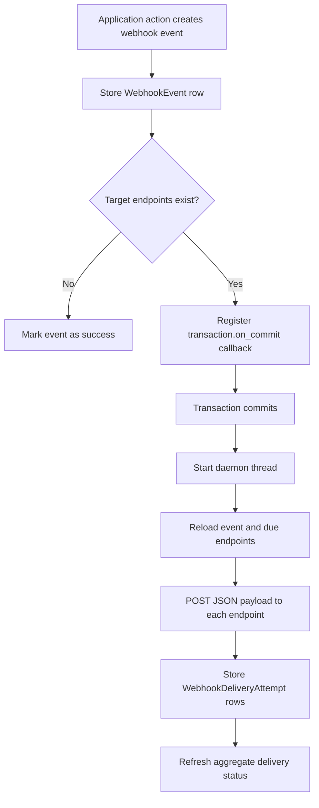

# Webhook Delivery

## Purpose

This document explains how the Web Application creates, delivers, retries, and
recovers webhook events.

## Delivery Lifecycle

Webhook delivery follows a persistence-first flow.

1. The application creates a `WebhookEvent` record with the event payload,
   event type, Issue reference, target endpoint snapshot, occurrence time, and
   initial delivery status.
2. If at least one target endpoint is enabled and subscribed to the event type,
   the application registers a post-commit callback.
3. After the surrounding database transaction commits successfully, the
   callback starts an asynchronous delivery worker.
4. The worker reloads the stored event, delivers it to due endpoints, records a
   `WebhookDeliveryAttempt` row for each attempt, and refreshes the aggregate
   event delivery status.

This design ensures that outbound delivery never starts for an event whose
database transaction later rolls back.

## Async Execution Model

Webhook delivery is not delegated to an external job runner. The current
implementation uses Django transaction callbacks plus a Python background
thread running inside the Web Application process.



The background thread is decoupled from the client connection. If the browser
or integration client disconnects after the database transaction commits, the
thread usually continues to run. The thread still depends on the lifetime of
the worker process. If the process exits, restarts, or crashes, the in-flight
thread stops with it.

## Endpoint Selection

Each `WebhookEndpoint` record defines:

- the target URL
- whether the endpoint is enabled
- the subscribed event types
- an optional signing secret
- timeout, retry count, and retry backoff settings

When the event is created, the application stores the matching endpoint ids on
the `WebhookEvent` record. Delivery later uses that stored snapshot instead of
recomputing recipients from the current admin configuration. This keeps the
delivery target set stable for the life of the event.

## Request Format

Each delivery attempt sends an HTTP `POST` request with a JSON body.

The persisted and delivered webhook body uses these root-level contract fields:

- `base_url`
- `event_id`
- `event`
- `occurred_at`
- `actor`
- `data`

The `data` field contains the emitted Issue snapshot. Event-specific payload
additions such as `changes`, `transition`, and `comment` remain at the root
level beside `data`.

The request headers include:

- `Content-Type: application/json`
- `X-Webhook-Event`
- `X-Webhook-Event-Id`
- `X-Webhook-Timestamp`
- `X-Webhook-Signature` when the endpoint has a signing secret

The signature is an HMAC-SHA256 digest over the timestamp, a literal period,
and the encoded request body.

## Retry And Status Rules

For each endpoint, the delivery worker evaluates the latest recorded attempt.

- If no attempt exists yet, delivery starts immediately.
- If the latest attempt succeeded, the endpoint is skipped.
- If the latest attempt failed and the retry backoff window has not expired,
  the endpoint is deferred until a later run.
- If the latest attempt count has reached the configured retry limit, the
  endpoint is treated as exhausted.

The aggregate `WebhookEvent.delivery_status` is refreshed after each delivery
run.

- `pending`: no attempt has been recorded yet for the target endpoints
- `partial_failure`: at least one attempt has been recorded and at least one
  endpoint still has remaining retry capacity
- `failed`: all remaining endpoints are exhausted
- `success`: all target endpoints succeeded, or no target endpoints exist

Each `WebhookDeliveryAttempt` record stores request headers, request body,
response status, response body, error message, success flag, duration, and
attempt timestamp for audit and troubleshooting purposes.

## Operational Recovery

Operators can process pending or retryable deliveries manually from
`src/webapp`:

```bash
python3 manage.py process_webhook_deliveries
```

The command scans non-success webhook events and attempts only the deliveries
that are currently due.

## Current Limitations

- Delivery runs inside the Web Application process and is not backed by an
  external durable queue.
- The background worker is a daemon thread, so it does not survive worker
  shutdown.
- A worker restart, crash, or deployment can interrupt an in-flight delivery.
- Recovery depends on the persisted `WebhookEvent` and
  `WebhookDeliveryAttempt` records plus the retry management command.