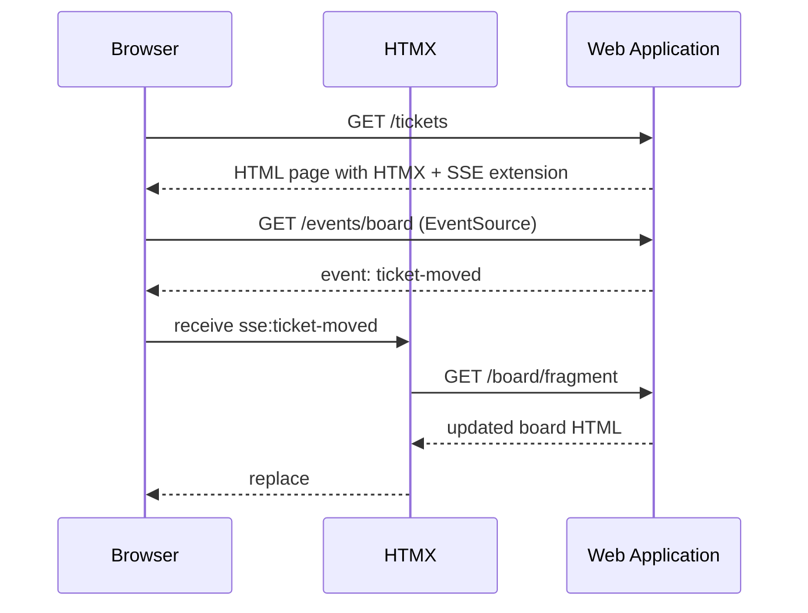

# HTMX with HTTP Server-Sent Events

## Purpose

This guide shows how to use HTMX with HTTP Server-Sent Events (SSE) in this
project. It focuses on unidirectional live updates, such as refreshing a Kanban
Board when a Ticket changes Workflow State.

## When to Use SSE

Use SSE when the server needs to push updates to the browser without the browser
sending a new request each time.

Good fits in this project:

- live Kanban Board updates
- new Ticket notifications
- Ticket comment streams
- Team workload or queue updates

Use regular HTMX requests instead when the browser initiates the interaction,
such as form submissions, filtering, or button clicks.

## Current HTMX Pattern

With current HTMX releases, SSE support is provided by the dedicated SSE
extension. Prefer this extension-based approach over the older experimental
`hx-sse` attribute.

The important attributes are:

- `hx-ext="sse"` to enable the extension
- `sse-connect="..."` to open the EventSource connection
- `sse-swap="..."` to swap incoming event payloads into the DOM
- `hx-trigger="sse:event-name"` to react to an SSE event with a follow-up HTMX
  request
- `sse-close="..."` to close the stream when a specific event arrives

## Project Guidance

- Serve HTMX and the SSE extension from local static files, not a CDN.
- Use named events instead of relying on the default `message` event for domain
  updates.
- Keep event names aligned with the domain language, for example
  `ticket-created`, `ticket-moved`, or `ticket-comment-added`.
- Treat the Kanban Board as a derived view of Tickets grouped by Workflow State.
- Keep the SSE endpoint read-only. Use normal HTTP endpoints for commands and
  state changes.

## Client Setup

In Django templates, load HTMX and the SSE extension from static files.

```html

<script src=""></script>
<script src=""></script>
```

If the whole page uses SSE behavior, you can enable the extension high in the
DOM tree.

```html
<body hx-ext="sse">
    ...
</body>
```

If only one section uses SSE, keep the extension scoped to that section.

## Basic Connection Pattern

Attach `hx-ext` and `sse-connect` on the element that owns the stream.

```html
<section
    hx-ext="sse"
    sse-connect="/events/board"
>
    <div id="board-updates" sse-swap="ticket-moved"></div>
</section>
```

When the server emits an SSE event named `ticket-moved`, HTMX swaps the event
data into `#board-updates`.

## Listening for the Default Message Event

If the server does not send named events, browsers treat incoming messages as
the `message` event.

```html
<div hx-ext="sse" sse-connect="/events/board" sse-swap="message"></div>
```

Prefer named events for this project because they make Ticket lifecycle updates
clearer and easier to route.

## Multiple Event Names

A single connection can listen for multiple event types.

```html
<section hx-ext="sse" sse-connect="/events/board">
    <div id="board-column-updates" sse-swap="ticket-moved,ticket-created"></div>
    <div id="comment-updates" sse-swap="ticket-comment-added"></div>
</section>
```

This works well when one SSE endpoint publishes several related Ticket events.

## Triggering Follow-Up HTMX Requests

Sometimes the SSE payload should not contain final HTML. In that case, let the
event trigger a normal HTMX request.

```html
<section hx-ext="sse" sse-connect="/events/board">
    <div
        hx-get="/board/fragment"
        hx-trigger="sse:ticket-moved"
        hx-target="#kanban-board"
        hx-swap="outerHTML"
    ></div>
</section>
```

Prefer this pattern when:

- several parts of the page depend on the same change
- the server already has a fragment endpoint for the updated view
- you want the SSE event to remain a small notification instead of carrying full
  HTML

## Closing the Stream

Use `sse-close` when the server should terminate the stream explicitly.

```html
<section hx-ext="sse" sse-connect="/events/board" sse-close="stream-complete">
    <div sse-swap="ticket-moved"></div>
</section>
```

## Expected Server Response Format

The SSE endpoint must return `text/event-stream` and send messages in standard
SSE format.

Example with a named event:

```text
event: ticket-moved
data: <div id="kanban-board">...</div>

```

Example with the default event:

```text
data: <div id="kanban-board">...</div>

```

## Recommended Event Design

Prefer small, explicit event names that describe what happened:

- `ticket-created`
- `ticket-moved`
- `ticket-assigned`
- `ticket-comment-added`

Avoid generic names such as `update` or `refresh` unless the stream truly has
only one kind of event.

## Suggested Pattern for the Kanban Board

For the Kanban Board, the simplest reliable pattern is:

1. open one SSE connection for board updates
2. emit named events when a Ticket changes Workflow State or assignment
3. let the event trigger a GET request for the board fragment
4. replace the board DOM with the updated fragment

This keeps the stream payload small and avoids duplicating rendering logic
between the page request and the SSE response.

## Example Flow



## Common Mistakes

- using the old `hx-sse` syntax instead of the SSE extension
- putting `sse-connect` on one element and expecting unrelated elements outside
  that subtree to receive the same stream
- sending command semantics over SSE instead of using normal HTTP requests
- using unnamed events for several different update types
- pushing large page-sized HTML payloads when a fragment refresh is enough

## Summary

Use HTMX SSE as a read-side update mechanism. Keep commands on normal HTTP
endpoints, stream named Ticket events from a `text/event-stream` endpoint, and
prefer fragment refreshes when a Workflow State change affects the Kanban Board.