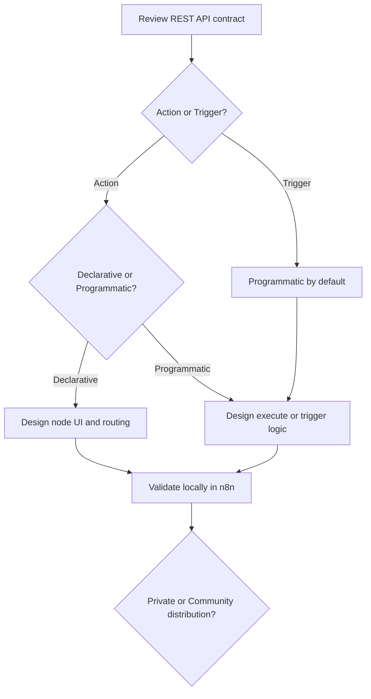

# n8n Custom Node Development

## Purpose

This guide explains how to plan, implement, validate, and optionally distribute
custom n8n nodes for this project.

It is based on the official n8n "creating nodes" documentation, but it is
adapted to the architecture and terminology of this repository.

## Role in This Project

The custom n8n node is an **Integration System**. It consumes the
**REST API** exposed by the **Web Application**.

Keep these boundaries explicit:

- The **Web Application** remains the system of record.
- The **REST API** remains the public machine-facing contract.
- The n8n node translates workflow input into API calls.
- The n8n node must not duplicate business rules that belong in the
  **Web Application**.

## Table of Contents

- [When to use this guide](#when-to-use-this-guide)
- [Document map](#document-map)
- [Coverage of official n8n topics](#coverage-of-official-n8n-topics)
- [Recommended workflow](#recommended-workflow)
- [Official references](#official-references)

## When to Use This Guide

Use this documentation when you need to:

- add a new custom n8n node package for this repository
- add a new resource or operation to the existing node package
- add or change credentials used by the node
- decide whether a feature should be an action node or a trigger node
- validate or distribute the node after implementation

## Document Map

| Document | Purpose |
| --- | --- |
| [Planning and Architecture](planning-and-architecture.md) | Explains how to choose the right node type, implementation style, UI design, and project boundary. |
| [Implementation Reference](implementation-reference.md) | Explains the practical build details for node files, credentials, UI elements, error handling, and versioning. |
| [Testing and Distribution](testing-and-distribution.md) | Explains local validation, troubleshooting, private installation, and optional community publishing constraints. |

## Coverage of Official n8n Topics

The official n8n node-creation guidance spans many pages. This local doc set
groups those pages into contributor-oriented topics for this repository.

| Official Topic Area | Covered In |
| --- | --- |
| overview and overall node-creation workflow | [README](README.md) |
| planning, node types, declarative vs programmatic choice, and node UI design | [Planning and Architecture](planning-and-architecture.md) |
| development environment, declarative build patterns, programmatic build patterns, and build reference topics | [Implementation Reference](implementation-reference.md) |
| UI elements, code standards, error handling, credentials files, node versioning, and paired items | [Implementation Reference](implementation-reference.md) |
| local testing, troubleshooting, private installation, and community distribution constraints | [Testing and Distribution](testing-and-distribution.md) |

## Recommended Workflow

1. Review the target **REST API** endpoints and confirm the node only needs API access.
2. Decide whether the feature is an action node or a trigger node.
3. Choose declarative or programmatic implementation.
4. Design the smallest useful n8n user interface.
5. Implement node metadata, credentials, operations, and error handling.
6. Validate the node locally against realistic workflow inputs.
7. Decide whether the package stays private or needs community-ready packaging.

## Official References

The local documents in this directory summarize and adapt the official n8n
guidance. Use the original documentation when you need API details or current
tooling specifics.

- [n8n Creating Nodes Overview](https://docs.n8n.io/integrations/creating-nodes/overview/)
- [n8n Plan a Node](https://docs.n8n.io/integrations/creating-nodes/plan/)
- [n8n Build a Node](https://docs.n8n.io/integrations/creating-nodes/build/)
- [n8n Build Reference](https://docs.n8n.io/integrations/creating-nodes/build/reference/)
- [n8n Test Nodes](https://docs.n8n.io/integrations/creating-nodes/test/)
- [n8n Deploy Nodes](https://docs.n8n.io/integrations/creating-nodes/deploy/)